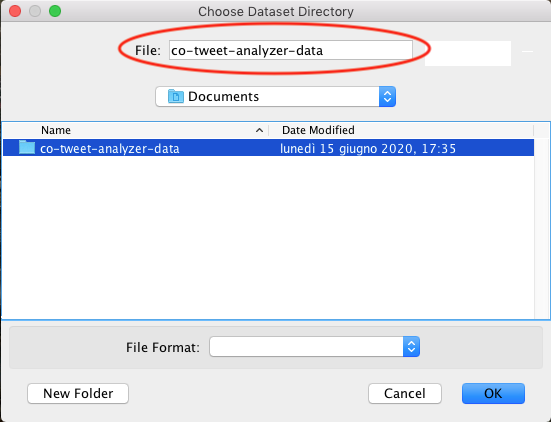

# Co-Tweet Analyzer

This project was created for educational purposes as the result of the internship about data analysis with [Scala](https://www.scala-lang.org) language and the [Apache Spark](http://spark.apache.org) framework at  *[DIMES](https://www.dimes.unical.it)* of the *University of Calabria*.

*Co-Tweet Analyzer* is a desktop app which allows to query a dataset containing several tweets about COVID-19. Actually, only four queries was implemented:
- **Languages Query** - calculates how many tweets was posted for every languages.
- **Sources Query** - calculate how many tweets have been posted via a specific platform.
- **Hashtags Query** - calculate for each hashtag how many times it has been used.
- **Users Query** - calculate how many tweets each of the users in the dataset has posted.

---

## Dataset

Dataset contains Tweets of users who have applied the following hashtags: #coronavirus, #coronavirusoutbreak, #coronavirusPandemic, #covid19, #covid_19, #epitwitter, #ihavecorona.
The tweets have been collected from March 1st to April 15th 2019.

Dataset was obtained through [www.kaggle.com](https://www.kaggle.com). To have more info about it visit follow pages:
- [Coronavirus (covid19) Tweets - March](https://www.kaggle.com/smid80/coronavirus-covid19-tweets)
- [Coronavirus (covid19) Tweets - early April](https://www.kaggle.com/smid80/coronavirus-covid19-tweets-early-april)

> Before being used in the project, the dataset was converted from *CSV* to *parquet* for optimization purposes.
The *[Pandas](https://pandas.pydata.org)* framework was used for the conversion.

## Develompment

The following language and frameworks have been used to develop this simple app:
- **Scala**
    - scala-sdk 2.12.12  
    - sbt 1.3.10
    - jdk 13.0.2
- **Apache Spark** 2.4.5
- **Swing** - to implement UI
- **JFreeChart** 1.5.0 - to show query results on chart

> Swing and JFreeChart was used only because frontend care is not the subject of this internship.

## Installation

> If you are visiting this repository on Github you can avoid reading this section beacuse it is reserved for who has concerned files.

All you need to run *Co-Tweet Analyzer* app is inside `co_tweet_analyzer_jar.zip`, while dataset to analyze is inside `co-tweet-analyzer-data.zip`.  

There are some very simple steps to follow:
1. Unzip `co-tweet-analyzer-data.zip` to extract dataset directory named `co-tweet-analyzer-data` and put it where you prefer.
1. Unzip `co_tweet_analyzer_jar.zip` to extract a directory named `co_tweet_analyzer_jar` (it contains the `co-tweet-analyzer.jar` and all its dependencies).
1. Open your terminal and run `java -jar <path-to-executable-jar>/co-tweet-analyzer.jar`.

> The `co-tweet-analyzer.jar` file must be inside the `co_tweet_analyzer_jar`directory with all its dependencies to work correctly.

## Usage

UI implemented is very simple and intuitive to use, however, due to use of Swing, UI isn't flexible (and its performance is very poor compared to more recent frameworks), therefore if you don't know how select dataset root-path (you do it in opening window) you may never be able to run some query.

To make sure you select the path correctly, then you've launched the app, you have to select the `co-tweet-analyzer-data` directory in the dialog window without going into it.

For example if `co-tweet-analyzer-data` is inside the `Documents` directory you have to position selection window into `Documents` and select `co-tweet-analyzer-data`: make sure that `co-tweet-analyzer-data` is displayed in the label "File".

The screenshot below shows an example to select path correctly:

## Info

This project was made by [Gian Marco Gullà](mailto:gullagianmarco@gmail.com).
